# Code Archaeologist - System Architecture

## High-Level Architecture

```mermaid
graph TB
    User[👤 User] --> Frontend[🎨 Vercel Frontend<br/>Next.js 14]
    Frontend --> API[🚀 REST API Server<br/>Node.js + TypeScript]
    
    API --> Excavator[⛏️ Excavator Agent]
    API --> Jobs[(💾 Job Storage<br/>In-Memory)]
    
    Excavator --> Git[📚 Git Repository<br/>simple-git]
    Excavator --> Gemini[🧠 Google Gemini<br/>1.5 Pro<br/>2M Context]
    Excavator --> Metrics[📊 Code Metrics<br/>Complexity, Maintainability]
    
    Gemini --> Analysis[📋 Archaeological Analysis]
    Analysis --> Report[📄 Excavation Report]
    
    Kestra[⚙️ Kestra Orchestrator] -.-> Excavator
    CodeRabbit[🐰 CodeRabbit] -.-> GitHub[📦 GitHub Repository]
    Oumi[🎓 Oumi Training] -.-> CustomModel[🤖 Custom Model<br/>Future]
    
    style Frontend fill:#0ea5e9
    style Gemini fill:#fbbf24
    style Kestra fill:#a855f7
    style Oumi fill:#f97316
    style CodeRabbit fill:#10b981
```

## Data Flow

## Component Breakdown

### 1. Frontend (Vercel)
- **Technology**: Next.js 14, TypeScript, Tailwind CSS
- **Pages**: 
  - `/` - Landing page
  - `/excavate` - Excavation form
  - `/results/[jobId]` - Results visualization
  - `/about` - Project information
- **Features**:
  - Real-time job status polling
  - Interactive file details
  - Responsive design

### 2. REST API Server
- **Technology**: Node.js, TypeScript
- **Port**: 3001
- **Endpoints**:
  - `POST /api/excavate` - Start excavation
  - `GET /api/jobs` - List all jobs
  - `GET /api/jobs/{id}` - Get job status
  - `GET /api/jobs/{id}/report` - Get full report
  - `GET /health` - Health check

### 3. Excavator Agent
- **Core Engine**: TypeScript
- **Responsibilities**:
  - Repository discovery
  - Git history analysis
  - Code metrics calculation
  - AI context extraction
  - Report generation
- **Modes**:
  - CLI mode: `pnpm run excavate`
  - API mode: Called via REST API
  - Interactive mode: `pnpm run query`

### 4. Google Gemini Integration
- **Model**: gemini-1.5-pro
- **Context Window**: 2 million tokens
- **Usage**:
  - Code context analysis
  - Business reasoning extraction
  - Knowledge graph generation
  - Interactive queries

### 5. Kestra Orchestration
- **Purpose**: Long-running workflow management
- **Features**:
  - Declarative YAML workflows
  - State persistence
  - Human-in-the-loop gates
  - Event-driven triggers
- **Workflows**:
  - `excavation-saga` - Main analysis workflow

### 6. Oumi Training Infrastructure
- **Purpose**: Custom model fine-tuning
- **Configuration**: LoRA-based training
- **Base Model**: Llama-3.2-3B-Instruct
- **Status**: Infrastructure ready, training optional

### 7. CodeRabbit Quality Gate
- **Purpose**: Automated code review
- **Integration**: GitHub App
- **Features**:
  - PR reviews
  - Custom rules
  - Security scanning
  - Configurable tone

## Deployment Architecture

## Security Considerations

1. **API Keys**: Stored in `.env`, never committed
2. **CORS**: Configured for Vercel frontend only
3. **Rate Limiting**: Implemented in Gemini client
4. **Input Validation**: All user inputs validated
5. **Error Handling**: Sensitive errors not exposed

## Scalability Notes

### Current Limitations
- In-memory job storage (loses data on restart)
- Single API server instance
- Local Kestra deployment

### Future Improvements
- PostgreSQL for job persistence
- Horizontal API scaling
- Cloud-hosted Kestra
- Redis for caching
- WebSocket for real-time updates

## Performance Metrics

- **Excavation Speed**: ~10 files in 30-60 seconds (with AI)
- **Excavation Speed**: ~50 files in 10 seconds (without AI)
- **API Response Time**: < 100ms for status checks
- **Gemini Latency**: 2-5 seconds per analysis
- **Frontend Load Time**: < 1 second (Vercel Edge)

